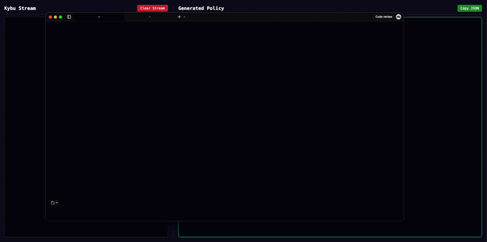

# Kybu: Zero-Touch AWS IAM Policy Generator

**Kybu** is a lightweight, local CLI tool that generates production-ready IAM policies by listening to your actual AWS usage.

Instead of guessing which permissions you need, just run your commands and let Kybu "forge" a **Least Privilege** policy in real-time based on the forensic data it catches from AWS telemetry.



## Key Features

- **Zero-Touch Configuration:** Automatically injects `csm_enabled = true` into your `~/.aws/config` on startup and removes it gracefully on exit. No manual file editing required.
- **Forensic Resource Scraper:** Goes beyond standard telemetry. Kybu scrapes raw AWS error messages to find specific Resource ARNs (S3 buckets, DynamoDB tables, KMS keys) for true **Principle of Least Privilege (PoLP)**.
- **Live Web Dashboard:** A sleek, dark-mode interface built with WebSockets. Watch your policy grow and your logs stream in real-time.
- **Smart S3 Suffixing:** Automatically detects if a permission needs a bucket-level ARN (`arn:aws:s3:::bucket`) or an object-level ARN (`arn:aws:s3:::bucket/*`).
- **Universal Compatibility:** Works with the AWS CLI, AWS SDKs (Go, Python, JS, etc.), and any tool that supports AWS Client Side Monitoring.

---

## Installation & Setup

### Download Pre-built Binaries (Recommended)

The fastest way to get started is to download the latest version for your operating system (Windows, macOS, or Linux) from our **[Releases Page](https://github.com/InspectorGadget/kybu/releases)**.

### Moving Kybu to your PATH

To run kybu from any directory without typing the full path, move the binary to a system folder.

**macOS/Linux:**
Rename and move the binary to your executable path:

```bash
# Example for Intel Mac. Change filename to match your download.
sudo mv kybu-darwin-amd64 /usr/local/bin/kybu
```

Make it executable:

```bash
sudo chmod +x /usr/local/bin/kybu
```

--

**Windows:**

1. Rename the downloaded file (e.g., `kybu-windows-amd64.exe`) to simply `kybu.exe`.
2. Move it to a folder (e.g., `C:\Tools\`).
3. Add `C:\Tools\` to your system's **PATH** environment variable.

---

## How to Run

1. Open a terminal and run (If in PATH):

```bash
kybu
```

2. If Kybu is in your current directory, you can run it with:

```bash
# On macOS/Linux
./kybu-darwin-arm64

# On Windows
kybu-windows-amd64.exe
```

## Usage

1. Start Kybu: Once running, open your browser to http://localhost:8080.
2. Generate Traffic: Open a new terminal window and run the AWS commands you want to capture permissions for:

```bash
aws s3 ls s3://my-app-bucket
aws dynamodb describe-table --table-name UsersTable
```

3. Refine in Real-Time: Watch the dashboard as it logs all requests, extracts the exact resources, and builds the JSON.
4. Copy & Paste: Once finished, copy the generated JSON from the "Policy Output" window and paste it directly into the AWS IAM Console.

---

## Configuration Flags

- `--web-port`: The port where the dashboard will be hosted. (Default: 8080)

---

## Security & Privacy

1. 100% Local: Kybu runs entirely on your machine. No AWS credentials, telemetry, or metadata are ever sent to external servers or third parties.
2. Automatic Cleanup: Kybu is a good citizen. When you hit Ctrl+C or Control+C, it immediately restores your `~/.aws/config` to its original state, disabling CSM telemetry.
3. PoLP Focus: Unlike other generators that default to Resource: "\*", Kybu's heuristic engine prioritizes specific ARNs to keep your cloud environment secure. Kybu will try its best to find the exact resource, but if it can't, it will fall back to a wildcard. Always review the generated policy before applying it.

---

## Contributing

We welcome contributions!

1. Fork the repository.
2. Create a feature branch (`git checkout -b feature/AmazingFeature`).
3. Commit your changes.
4. Push to the branch and open a Pull Request.
